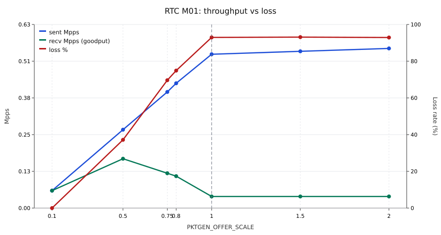
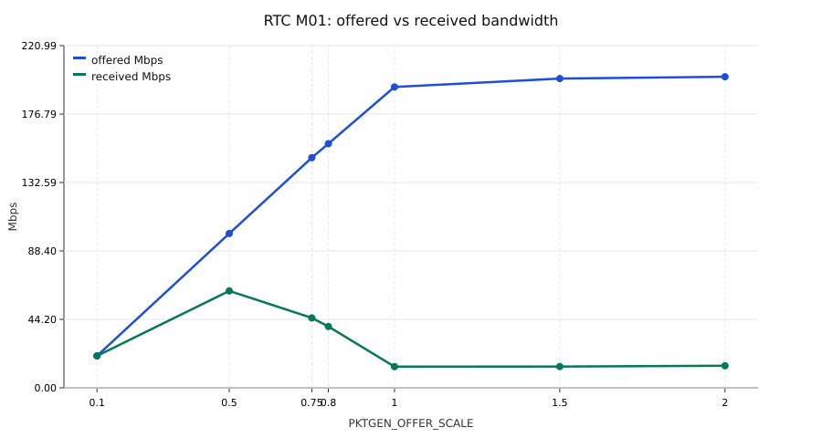
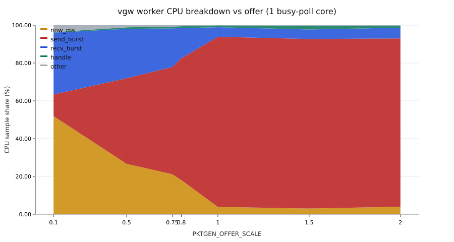
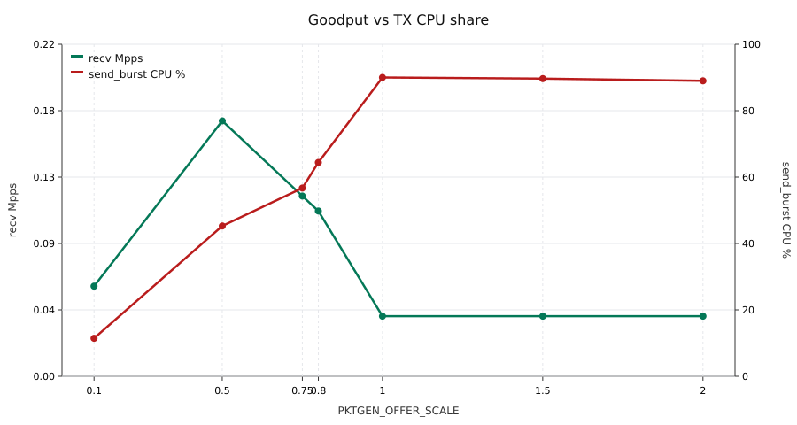

# RTC M01 Offer Sweep — Throughput, Loss, and CPU

**Date:** 2026-07-29  
**Datapath:** `rtc`, case `M01` (hot flow, 1 flow, 4 B payload, 46 B frames)  
**Topology:** pktgen `ens256` ↔ vgw `ens192` on the same L2; **upstream = client** (self-loop)  
**Sources:** `tools/pktgen/out/results_rtc_M01_s*.csv`, `tools/pktgen/out/perf/rtc_M01_s*/flame.svg`  
**Summary CSV:** [summary_table.csv](summary_table.csv)  
**Narrative + learning links:** [docs/knowledge/2026-07-29-offer-sweep-softswitch-contention.md](../../knowledge/2026-07-29-offer-sweep-softswitch-contention.md)

## 1. Executive summary

Raising offer load does **not** increase end-to-end goodput past a low knee. After `PKTGEN_OFFER_SCALE≈0.5`, **loss rises while received Mpps falls**. On the vgw worker flame graphs, CPU moves from idle time-reads (`now_ms`) into **`send_burst` / vmxnet3 TX** (up to ~90%). Forwarding logic (`handle`) stays **&lt;2%** of samples at every point.

**Interpretation:** the limiting factor is **shared virtual/physical NIC bandwidth contention** in the self-loop topology (pktgen TX competing with vgw TX), not session/timer/CPU compute in the gateway datapath. Low-offer `now_ms` dominance is an **idle busy-poll artifact**, not the cause of high-offer loss.

## 2. How to read “CPU” here

DPDK RTC busy-polls one lcore at ~**100% of that core**. Absolute “CPU busy %” from `top` is therefore uninformative for the worker.

What matters is **where samples land** inside that core (perf flame graph):

| Symbol | Meaning |
|--------|---------|
| `now_ms` | Monotonic time read each loop (chrono or TSC) |
| `recv_burst` | RX path / vmxnet3 receive |
| `send_burst` | TX path / vmxnet3 transmit |
| `handle` | L4 forward / NAT / session lookup |

Percentages below are **share of vgw worker samples** (≈ share of that one core’s time).

## 3. Results table

| scale | pktgen rate % | sent Mpps | recv Mpps | loss % | offered Mbps | received Mbps | CPU now_ms % | CPU send % | CPU recv % | CPU handle % |
|------:|--------------:|----------:|----------:|-------:|-------------:|--------------:|-------------:|-----------:|-----------:|-------------:|
| 0.1 | 0.38 | 0.06 | **0.06** | **0.00** | 20.6 | 20.6 | **51.9** | 11.5 | 32.7 | 0.3 |
| 0.5 | 1.90 | 0.27 | **0.17** | 37.2 | 99.6 | 62.6 | 26.7 | **45.3** | 26.1 | 0.8 |
| 0.75 | 2.86 | 0.40 | 0.12 | 69.6 | 148.6 | 45.1 | 21.2 | **56.7** | 20.5 | 0.9 |
| 0.8 | 3.05 | 0.43 | 0.11 | 74.9 | 157.6 | 39.6 | 18.1 | **64.4** | 16.0 | 1.0 |
| 1 | **100** | 0.53 | 0.04 | 93.0 | 194.3 | 13.7 | 3.9 | **90.0** | 5.1 | 1.0 |
| 1.5 | **100** | 0.54 | 0.04 | 93.1 | 199.7 | 13.7 | 3.0 | **89.7** | 5.1 | 2.0 |
| 2 | **100** | 0.55 | 0.04 | 92.9 | 200.9 | 14.2 | 4.0 | **89.0** | 5.7 | 1.1 |

Notes:

- Peak **goodput** in this sweep: **scale 0.5 → 0.17 recv Mpps** (already 37% loss).
- Only scale **0.1** is loss-free.
- Scales **≥1** all map to `pktgen rate=100` (full blast); they are one regime, not three independent offers.

## 4. Charts

### 4.1 Throughput vs loss



- **sent Mpps** keeps rising with offer (pktgen can still inject).
- **recv Mpps** peaks then **collapses**.
- **loss %** climbs in lockstep toward ~93% at full blast.

This pattern (more offered TX → less end-to-end delivery) matches **shared-medium congestion**, not a software compute ceiling.

### 4.2 Offered vs received bandwidth



Offered L2 Mbps grows with scale; received Mbps peaks near scale 0.5 (~63 Mbps) then falls to ~14 Mbps at full blast.

### 4.3 vgw CPU breakdown vs offer



| Regime | Dominant CPU | Meaning |
|--------|--------------|---------|
| Low (0.1) | `now_ms` ~52% | Empty poll loop; NIC underutilized |
| Mid (0.5–0.8) | `send_burst` 45→64% | TX path starts dominating |
| High (≥1) | `send_burst` ~90% | Core stuck in vmxnet3 TX |

`handle` never becomes material (&lt;2%). Optimizing timers or session structures cannot explain the loss cliff.

### 4.4 Goodput vs TX CPU



As **send_burst CPU share** rises, **recv Mpps** falls. The worker is not “too busy forwarding”; it is **blocked/spinning on TX** while the shared path is saturated by competing pktgen/vgw traffic.

## 5. Topology context

```text
pktgen (ens256) TX ──► vgw (ens192) RX
vgw (ens192) TX     ──► pktgen (ens256) RX   ← upstream == client (self-loop)
```

Both roles share the same VMware L2 / host uplink. Raising pktgen offer increases contention with vgw’s return TX, which shows up as:

1. Rising `send_burst` on the vgw flame graph  
2. Falling pktgen RX / rising loss  
3. Near-identical results for scale 1 / 1.5 / 2 (same rate=100 ceiling)

## 6. Conclusions

1. **Do not treat low-offer `now_ms` flame width as a throughput bottleneck.** It shrinks automatically when the NIC is busy.
2. **High-offer loss is consistent with pktgen↔vgw shared-bandwidth contention** under the self-loop upstream design.
3. **vgw application logic is not the bottleneck** (`handle` ≪ 2% at all scales).
4. **Next validation** should change topology, not micro-optimize timers:
   - Independent upstream on `ens224` (kernel echo), or  
   - Separate vSwitch / second VM for pktgen,  
   then re-run the same offer sweep and compare loss / recv Mpps / TX CPU share.

## 7. Artifacts

| File | Description |
|------|-------------|
| [fig1_throughput_loss.svg](fig1_throughput_loss.svg) | sent/recv Mpps + loss % |
| [fig2_mbps.svg](fig2_mbps.svg) | offered vs received Mbps |
| [fig3_cpu_breakdown.svg](fig3_cpu_breakdown.svg) | stacked CPU sample shares |
| [fig4_goodput_vs_tx_cpu.svg](fig4_goodput_vs_tx_cpu.svg) | goodput vs TX CPU |
| [summary_table.csv](summary_table.csv) | numeric table used for plots |
| `tools/pktgen/out/perf/rtc_M01_s*/flame.svg` | per-scale flame graphs |
